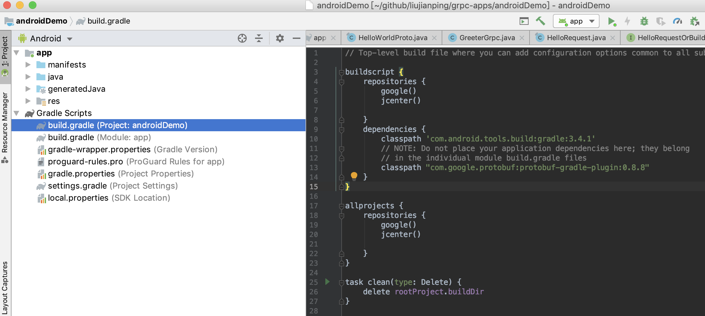
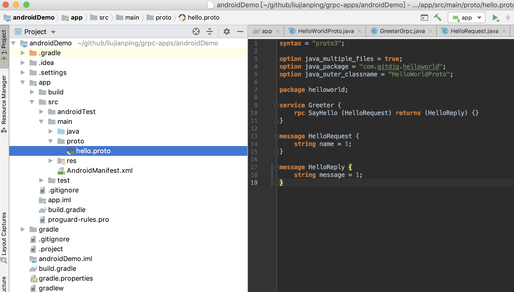
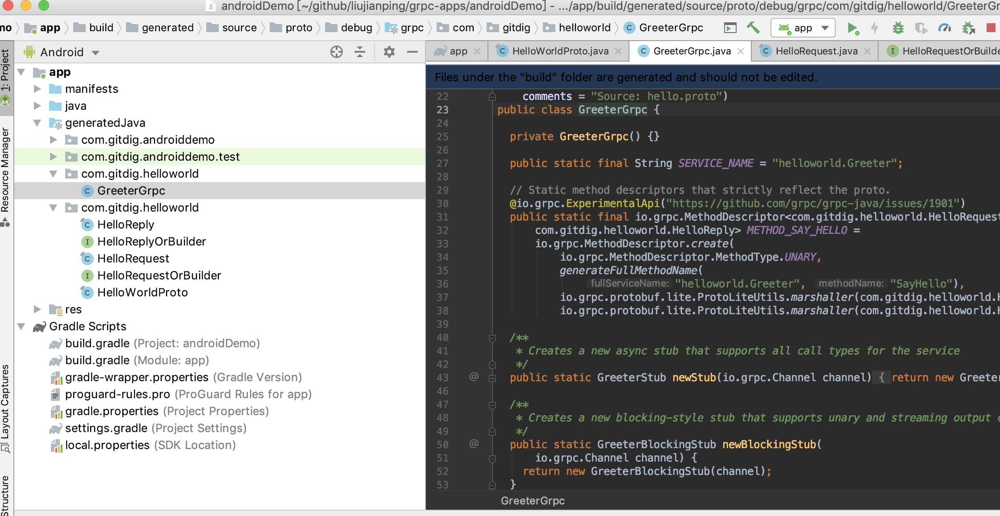

# Android 应用实现 gRPC 调用

## 1. 环境安装

保证整个过程在"全球通"的环境下操作。

### 1.1 JDK 安装

没什么好说的，下载安装。设置好相应的环境变量。完成后，通过 `java -version` 命令确认安装成功。

### 1.2 Android Studio 安装

[官网下载](https://developer.android.com/studio)安装包，按步骤安装即可。

## 2. 开启服务端

请参考[iOS 应用实现 gRPC 调用](/go-mobile-research-01/)服务端部分， 确认服务端服务启动。

## 3. 创建 Android 项目

虽然项目[grpc-java](https://github.com/grpc/grpc-java)提供完整的样例程序。但是缺少过程的结果，往往还是令初学者望而生畏。所以，从头开始一步一步的记录样例的实现过程，是有必要的。

### 3.1 创建 Basic Activity 项目

创建 Basic Activity 初始项目，过程只是简单的鼠标操作，同时输入相应的项目名。这个过程就不多说了。完成创建后，打开 `app/src/main/java/com/gitdig/androidDemo/MainActivity.java` 文件， 添加一句日志输出：

````java
protected void onCreate(Bundle savedInstanceState) {
        super.onCreate(savedInstanceState);
        setContentView(R.layout.activity_main);
        Toolbar toolbar = findViewById(R.id.toolbar);
        setSupportActionBar(toolbar);

        FloatingActionButton fab = findViewById(R.id.fab);
        fab.setOnClickListener(new View.OnClickListener() {
            @Override
            public void onClick(View view) {
                Snackbar.make(view, "Replace with your own action", Snackbar.LENGTH_LONG)
                        .setAction("Action", null).show();
                // Demo 日志输出
                Log.i("demo", "Hello Android");

            }
        });
    }
````

构建程序，并在模拟器中执行。在模拟器的选择中，可以选择版本比较低的模拟器，会比较小，下载速度更快一点。启动程序后，点击按钮，查看日志输出：`I/demo: Hello Android`. 初始程序构建完成。

### 3.2 新增 proto 文件，并生成 java 代码

在 Android 项目中，通过 proto 文件生成 java 代码的过程和 iOS 与 Go 的过程不一样，没有直接用到 `protoc` 命令行工具。而是通过 `protobuf-gradle-plugin` 插件的方式，在 Gradle 构建过程中自动生成。



首先配置插件以及 Gradle 构建过程, 将项目左栏视图切换成 `Android`,在 Gradle 脚本栏中，首先修改 `Project: androidDemo` 项目级 `build.gradle`文件。增加 `protobuf-gradle-plugin` 插件支持。

````gradle
buildscript {
    repositories {
        google()
        jcenter()
        
    }
    dependencies {
        classpath 'com.android.tools.build:gradle:3.4.1'
        // NOTE: Do not place your application dependencies here; they belong
        // in the individual module build.gradle files
        classpath 
        // 增加 protobuf-gradle-plugin 插件
        "com.google.protobuf:protobuf-gradle-plugin:0.8.8"
    }
}
...
````
在打开 `Module: app` 模块级 `build.gradle`，增加相应的构建脚本：

````gradle
apply plugin: 'com.android.application'
//应用插件
apply plugin: 'com.google.protobuf'

android {
    compileSdkVersion 29
    buildToolsVersion "29.0.0"
    defaultConfig {
        applicationId "com.gitdig.androiddemo"
        minSdkVersion 14
        targetSdkVersion 29
        versionCode 1
        versionName "1.0"
        testInstrumentationRunner "androidx.test.runner.AndroidJUnitRunner"
    }
    buildTypes {
        release {
            minifyEnabled false
            proguardFiles getDefaultProguardFile('proguard-android-optimize.txt'), 'proguard-rules.pro'
        }
    }
}

//插件构建脚本
protobuf {
    protoc {
        artifact = 'com.google.protobuf:protoc:3.0.0'
    }
    plugins {
        grpc {
            artifact = 'io.grpc:protoc-gen-grpc-java:1.0.0-pre2'
        }
        javalite {
            artifact = 'com.google.protobuf:protoc-gen-javalite:3.0.0'
        }
    }
    generateProtoTasks {
        all()*.plugins {
            javalite {}
        }
        ofNonTest()*.plugins {
            grpc {
                // Options added to --grpc_out
                option 'lite'
            }
        }
    }
}

dependencies {
    implementation fileTree(dir: 'libs', include: ['*.jar'])
    implementation 'androidx.appcompat:appcompat:1.0.2'
    implementation 'androidx.constraintlayout:constraintlayout:1.1.3'
    implementation 'com.google.android.material:material:1.0.0'
    testImplementation 'junit:junit:4.12'
    androidTestImplementation 'androidx.test:runner:1.2.0'
    androidTestImplementation 'androidx.test.espresso:espresso-core:3.2.0'
    // 增加插件依赖
    implementation 'javax.annotation:javax.annotation-api:1.2'
    implementation 'io.grpc:grpc-protobuf-lite:1.21.0'
    implementation 'io.grpc:grpc-okhttp:1.21.0'
    implementation 'io.grpc:grpc-stub:1.21.0'
}
````

以上 Gradle 脚本的配置就能实现构建过程中，通过 proto 文件自动生成 java 代码了。 不过需要注意的就是，proto 文件的位置是固定的。再次将左侧视图切换到 Project 视图。proto 文件的位置：`app/src/main/proto` 文件夹。



proto 文件夹与 proto 文件均通过手动创建。完成了以上过程，现在就可以构建一次项目，看看 java 文件是否生成。再切换会 Android 视图，就会发现生成的代码已经有了。



### 3.3 实现 gRPC 客户端调用

实现 gRPC 客户端的调用，代码很简单。首先是提供一个创建 gRPC 通信的客户端连接。直接再 MainActivity 类中增加一个功能函数：

````java
public class MainActivity extends AppCompatActivity {
    public static ManagedChannel newChannel(String host, int port) {
        return ManagedChannelBuilder.forAddress(host, port)
                .usePlaintext()
                .build();
    }
    ...
}
````

再在按钮点击事件中，发起客户端 gRPC 请求：

````java
    @Override
    protected void onCreate(Bundle savedInstanceState) {
        super.onCreate(savedInstanceState);
        setContentView(R.layout.activity_main);
        Toolbar toolbar = findViewById(R.id.toolbar);
        setSupportActionBar(toolbar);
        final GreeterGrpc.GreeterStub greeterStub = GreeterGrpc.newStub(newChannel("192.168.0.134", 50051));

        FloatingActionButton fab = findViewById(R.id.fab);
        fab.setOnClickListener(new View.OnClickListener() {
            @Override
            public void onClick(View view) {
                Snackbar.make(view, "Replace with your own action", Snackbar.LENGTH_LONG)
                        .setAction("Action", null).show();
                Log.i("demo", "Hello Android");

                //增加 gRPC 请求，打印日志
                HelloRequest request = HelloRequest.newBuilder().setName("JayL").build();
                greeterStub.sayHello(request, new StreamObserver<HelloReply>() {
                    @Override
                    public void onNext(HelloReply value) {
                        Log.i("demo", value.getMessage());
                    }

                    @Override
                    public void onError(Throwable t) {
                        Log.e("demo", t.getMessage());
                    }

                    @Override
                    public void onCompleted() {

                    }
                });

            }
        });
    }
````

因为涉及网络通信，打开模块app的配置文件: `app/src/main/AndroidManifest.xml`, 增加一行配置：
````xml
<?xml version="1.0" encoding="utf-8"?>
<manifest xmlns:android="http://schemas.android.com/apk/res/android"
    package="com.gitdig.androiddemo">
    <!-- 开启网络访问权限 -->
    <uses-permission android:name="android.permission.INTERNET"/>
...
<manifest>
````

构建程序，并在模拟器上执行，确认 gRPC 通信正常。完成该部分调研。